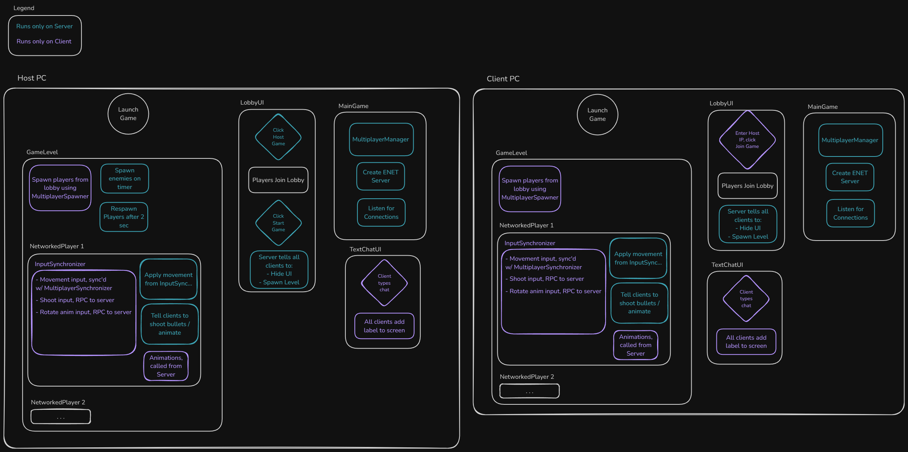

# Multiplayer POC godot

A Godot 4 multiplayer reference implementation. Originally created for [Dank Nooner](https://github.com/ssebs/DankNooner), this repo serves as a learning resource and code reference for anyone implementing multiplayer in Godot 4.

This project focuses on core networking concepts including:

- Client-server architecture using Godot's high-level multiplayer API
- Player synchronization and state management
- Network optimization and performance testing
- Connection handling and error recovery

Feel free to use this as a reference or starting point for your own Godot 4 multiplayer projects.

See [TODO.md](./TODO.md) for progress.

## Builds
- Download the latest build in [releases](https://github.com/ssebs/multiplayer-poc-godot/releases)
  - NOTE: This may not be fully up-to-date, try using godot to compile the project yourself!

## Demo (gif)

## Architecture

  
Click to view the Flow Diagram.

  
  

### Server Authority
> Once a player launches the game & selects "Host Game", they are the "server"

#### Lobby
- ENet server is started & listening for connections, callbacks signals are connected. (on_peer_connected, etc.)
- On connection:
  - Add connected player id (int) to the lobby list.
  - RPC to all to send "player connected" in chat. (Using `text_chat_ui`)
- On disconnection:
  - Same as "on connection", but "disconnect" instead.
  - `queue_free()` that player on all clients
- On "start game" pressed (only on host pc):
  - RPC to all:
    - Hide lobby ui
    - Instantiate the level & add node to scene tree
    - Set `MultiplayerManager` spawn nodes from level (needed for `MultiplayerSpawner` to sync spawns)
    - Spawn all players from lobby list
  - On the server only:
    - Start enemy spawn timer

#### In Game
- Listen for input from `InputSynchronizer`
  - Apply movement vector from `MultiplayerSynchronizer` (wasd => `move_and_slide()`)
  - If `shoot_bullet()` is called, spawn the bullet & shoot it locally
  - If `play_rotate_anim()` is called, play the animation locally
- Enemy AI
  - Collision detection w/ player, if hit player RPC to server & call `die()`
  - Navigation (to closest player), runs on a timer, server sets position
  
#### Text Chat (text_chat_ui)
- Client types msg, when pressing enter:
  - RPC to all with message + ID of sender
  - Clients render the msg
  - If `show_player_connected()` (or disconnected) is called as rpc, create UI Label / render

### Client Authority
- `InputSynchronizer` gets multiplayer authority for the local client
- In `_physics_process()`:
  - Listen for movement input as a vector & save to `MultiplayerSynchronizer`'s var (input_dir)
  - Listen for `shoot` / `rotate` Inputs, when used:
    - RPC call to server
- Typing / sending text chat to all peers
- Playing animations, spawning/despawning the nodes themselves (from `MultiplayerSpawner` on server)

## License
[AGPL](./LICENSE)
